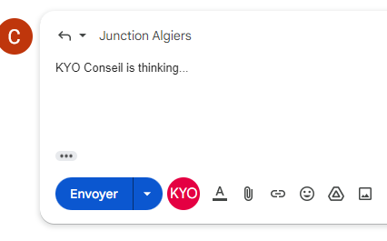

# KYO-conseil Email Auto-Responder Chrome Extension

This Chrome Extension is the solution to the first challenge of Junction Algeria 2023, KYO-conseil Email Auto-Responder. With the power of OpenAI's ChatGPT language model, the extension generates personalized and natural-sounding responses to incoming emails.

## Features

- Generate automated email responses using ChatGPT's advanced natural language processing capabilities.
- Choose from multiple response options to find the best one that fits your message and tone.
- Personalize your response by editing it before sending it out.
- Easy-to-use interface that seamlessly integrates with your email client.

## How to Use

1. Install the KYO-conseil Email Auto-Responder Chrome Extension.
2. get your API key from [OpenAI](https://openai.com/) and paste it in the extension's options page.
3. Navigate to your email client and compose a new email Response.
4. Click on the KYO-conseil icon in Toolbar.
   
   
5. Click the "Send" button to send the email.
   

## Privacy and Security

The KYO-conseil Email Auto-Responder Chrome Extension does not collect or store any personal information or email content. The extension sends your email content to OpenAI's servers to generate a response and then returns the response to your browser for display. OpenAI's servers do not store your email content and only use it to generate the response.

## About Junction Algeria 2023

Junction Algeria is a hackathon event that aims to bring together creative minds from different fields to solve real-world problems using technology. KYO-conseil Email Auto-Responder Chrome Extension is the solution to the first challenge of Junction Algeria 2023.
